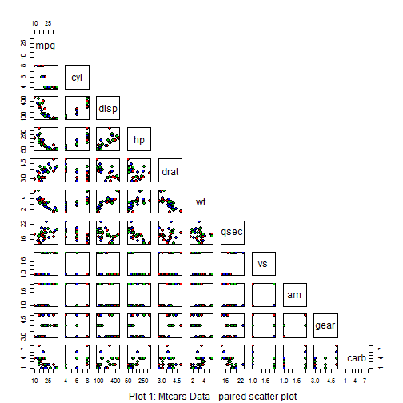
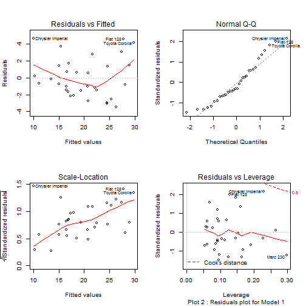

#### Executive Summary: 

This assignment paper analyses the `mtcars` database to identify if Automatic cars are more efficient than Manual cars (**MPG** used as **dependent variable**) . The first operation, a **t-test** conclusively showed that a performance difference existed between both types of cars - the null hypothesis can be rejected. Then, a linear regression analysis was done on a pre-calculated/identified  **"best fit" model**.  The nature of the correlationship between the various  significant **independent variables** and the **MPG** were assessed.The results showed **Manual cars** had better MPG indices , making them the  more efficient cars. For each unit of weight (1 ton) increase,  manual cars had a 2.936 increase in MPG.

#### Analysis


##### I - Exploratory Data Analysis and Pre-Processing:  
  
The `mtcars` data is loaded and checked to see if any cleaning/transformation is required. Some transformation is needed - relevant ***categorical variables*** (`am` as a minimum) transformed to ***factors***.  A paired plot is then done, to get a preview of  the data distributions. (Appendix 1 , 2).


##### II - Hypothesis Testing (t-test):  


The null hypothesis is formulated  and tested for possible rejection:  

**H0** = *There is no performance difference (MPG) between Automatic and Manual cars*  

As the **t-test** compares the means of two data sets, `mtcars` data was split into  **"automatic"** and a **"manual"** data subsets. The **r code** for the test is ` t.test(data_aut,data_man)`. Results obtained were  (t = -3.7671), (df = 18.332), (p-value = 0.001374). With the P-value obtained, the null hypothesis can confidently be rejected and the alternate hypothesis **H1** accepted.:  

**H1** = *There exists a performance difference between Automatic and Manual cars*  


##### III - Selecting the best model:


After establishing the H1 hypothesis , the next step was to find an appropriate model for assessing the correlations in the data sample.The difficulty was to get an adequately simple and reliable model, which did not compromise prediction outcomes - in essence trying to find which subset of the equation (Y = b0 + b2 X2...... + epsilon) was the best fit.  
**"Backward Elimination"** was used as method.  With this method , a linear regression of the full model is first built (*lm(mpg ~ am, data=mtcars)*) then a stepwise elimination of individual variables performed. To dtermine which variable to eliminate, a so-called **partial F-test** must be performed on each of them. The `step` function in **r** automatically performs this operation and produces the **"best fit model"**. A**"Forward elimination"**  (inverse to the **backward test **) test was also done to validate the previous result. Interestingly the forward elimination introduced an extra variable in the model.
Backward Elimination gave **Model 1** and Forward elimination **Model 2**.  


- **Model 1**:  lm(formula = **mpg ~ wt + qsec + am**, data = mtcars).  
- Model 1 Statistics:  F-statistic: 52.75 on 3 and 28 DF,  p-value: 1.21e-11  
- **Model 2** :  lm(formula = mpg ~ **am + hp + wt + qsec**, data = mtcars)  
- Model 2 Statistics:  F-statistic: 40.74 on 4 and 27 DF,  p-value: 4.589e-11

In view of the p-values, Model 1 was deemed a better model and used for subsequent analysis.
Selected Model was **lm(formula = mpg ~ wt + qsec + am, data = mtcars**.(Appendix3 for models stats)


##### IV - Model Accuracy (CI):  


It  is necessary to determine how reliable our model is , i.e. we need to analyze the **Confidence Interval**" of the model. This is achieved by applying the r function `confint()` to the model used and then evaluate the results. For our selected model, all the values were shown to be within the range defined by the CI=2.5% (Lower) and CI=97.5% (Upper) (Appendix 4 for CI table). Our model can be considered as significant.

##### IV - Interpret Results ( Model 1)


```
##             Estimate Std. Error t value  Pr(>|t|)
## (Intercept)    9.618     6.9596   1.382 1.779e-01
## wt            -3.917     0.7112  -5.507 6.953e-06
## qsec           1.226     0.2887   4.247 2.162e-04
## amManual       2.936     1.4109   2.081 4.672e-02
```

**Intercept** : 
For every unit increase in "Weight" and in "Quarter Mile Time", the MPG index goes up by 9.6 Miles/(US) gallon.  Meaning the car covers 9.6 more miles for every gallon of fuel consumed.  

**Slopes** :  
**wt= -3.917** :  Negative slope meaning that when weight increases, the MPG index goes down . The car covers less miles per gallon and becomes less efficient. For each unit of weight increase, the car becomes 3.92 Miles/galon less efficient. 

**qsec= 1.226** : Positive slope, meaning that when the "Quarter Mile Time Index" increases by one unit (car is slower), the car becomes more efficient by covering an additional 1.23 Miles per Gallon.  

**amManual=2.936** : Positive slope. A manual car has an MPG index of 2.936 extra compared to an automatic car. Meaning it will cover 3 more miles compared to an automatic car, making it a more efficient vehicle.  

*(for units , see Appendix 5)*


##### V - Residuals :   
  

A plot of the residuals is to be found in Appendix  6.  

**Residual Plot** :If the points in a residual plot are randomly dispersed around the horizontal axis, a linear regression model is appropriate for the data; otherwise, a non-linear model is more appropriate. In our current case, in the *The Residuals vs. Fitted* plot the points do seem to be randomly distributed along the horizontal line. So our linear regression analysis is valid.  

**Q -Q Plot** : This is (quantile-quantile or q-q plot) used to check the validity of a distributional assumption for a data set. The basic idea is to compute the theoretically expected value for each data point based on the distribution in question. If the data indeed follow the assumed distribution, then the points on the q-q plot will fall approximately on a straight line. This appears to be the case here, hence our assumption of normal distribution is fairly correct.  

**Scale-Location plot** - This plot is similar to the ** residuals vs. fitted values** plot, but it uses the square root of the standardized residuals. Like the first plot, there should be no discernable pattern to the plot, if our linear regression analysis is valid. Indeed the results show that the point are randomly distributed on both sides of the horizontal line.


END

\pagebreak


#### Appendix


##### Appendix 1 : `mtcars` Data Exploration


```
## 'data.frame':	32 obs. of  11 variables:
##  $ mpg : num  21 21 22.8 21.4 18.7 18.1 14.3 24.4 22.8 19.2 ...
##  $ cyl : num  6 6 4 6 8 6 8 4 4 6 ...
##  $ disp: num  160 160 108 258 360 ...
##  $ hp  : num  110 110 93 110 175 105 245 62 95 123 ...
##  $ drat: num  3.9 3.9 3.85 3.08 3.15 2.76 3.21 3.69 3.92 3.92 ...
##  $ wt  : num  2.62 2.88 2.32 3.21 3.44 ...
##  $ qsec: num  16.5 17 18.6 19.4 17 ...
##  $ vs  : Factor w/ 2 levels "0","1": 1 1 2 2 1 2 1 2 2 2 ...
##  $ am  : Factor w/ 2 levels "Auto","Manual": 2 2 2 1 1 1 1 1 1 1 ...
##  $ gear: num  4 4 4 3 3 3 3 4 4 4 ...
##  $ carb: num  4 4 1 1 2 1 4 2 2 4 ...
```


----

##### Appendix 2 : Scatter plot for `mtcars`  
paired  

 

----

\pagebreak

##### Appendix 3 : Statistics for Model 1 and Model 2  \newline 
\newline  
  
  
 
 **Model 1 Statistic**

```
##             Estimate Std. Error t value Pr(>|t|)
## (Intercept) 17.44019    9.31887   1.871 0.072149
## amManual     2.92550    1.39715   2.094 0.045791
## hp          -0.01765    0.01415  -1.247 0.223088
## wt          -3.23810    0.88990  -3.639 0.001141
## qsec         0.81060    0.43887   1.847 0.075731
```


**Model 2 Statistic**

```
##             Estimate Std. Error t value Pr(>|t|)
## (Intercept) 17.44019    9.31887   1.871 0.072149
## amManual     2.92550    1.39715   2.094 0.045791
## hp          -0.01765    0.01415  -1.247 0.223088
## wt          -3.23810    0.88990  -3.639 0.001141
## qsec         0.81060    0.43887   1.847 0.075731
```

----


##### Appendix 4 : Confidence Interval of selcted model (Model 1) 


```
##                2.5 % 97.5 %
## (Intercept) -4.63830 23.874
## wt          -5.37333 -2.460
## qsec         0.63457  1.817
## amManual     0.04573  5.826
```

----


##### Appendix 5 : Units 

- MPG = Miles (US) / Gallon :  Miles covered per Gallon : 1 Unit = 1 (mile/gallon)
- qsec = 1/4 mile time : Time taken to cover a quarter mile : 1 unit = 1/4 (mile / Seconds)
- wt =  (lb/1000)= weight in tons : 1 unit = 1 ton

----

\pagebreak

### Appendix 6 : Residual plots

 

----

END 
